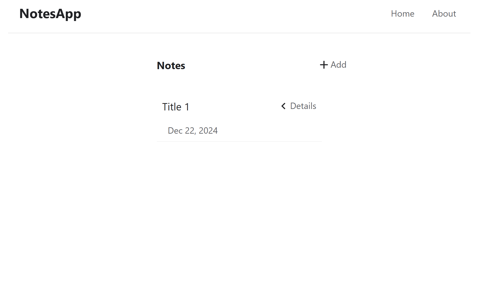
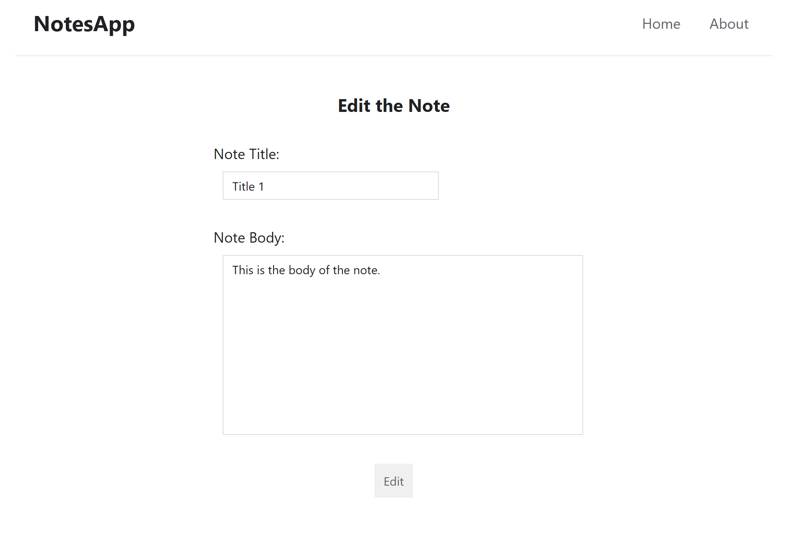

# Containerized Notes Web App

## Table of Contents

1. [Description](#description)
2. [Screenshots](#screenshots)
3. [Installation](#installation)
4. [Usage](#usage)
5. [Contributing](#contributing)
6. [Contact](#contact)

## Description

This project is a containerized web application designed to show how a web application can be containerized using Docker. The app is built using React for the frontend, Express.js for the backend, and PostgreSQL as the database, all orchestrated using Docker Compose.

## Screenshots





## Installation

1. You need to have Docker installed on your system. If you don't, you can install the latest version from [here](https://www.docker.com/get-started/).

2. Clone the repository:

```
git clone https://github.com/YunusCelik21/Notes-app.git
```
```
cd Notes-app
```

3. Start the containers using Docker Compose:

```
docker compose up
```

or

```
docker compose up -d
```

If you want to run the containers in the background.

## Usage

Once the containers are running, you can visit the website on your web browser at http://localhost:3000.

You can also interact with the API at http://localhost:4000.
 
- When you are done, stop and kill the containers:

```
docker compose down
```

## Contributing

Contributions are welcome! Please follow these steps:

1. Fork the repository.

2. Create a feature branch:

```
git checkout -b feature-name
```

3. Commit your changes and open a pull request.

## Contact

Email: 21yunuscelik21@gmail.com
